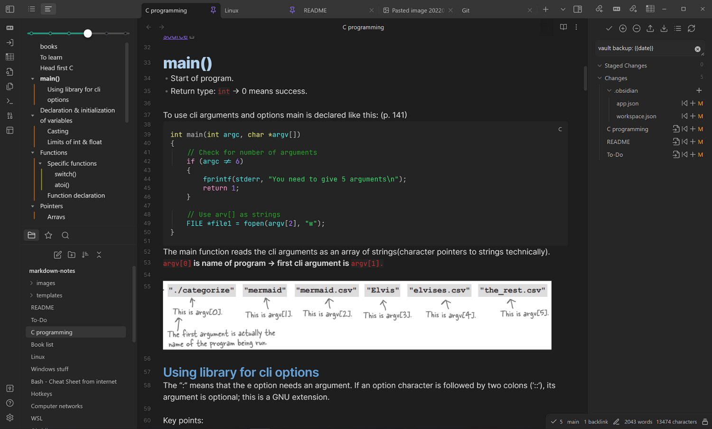

# markdown-notes
 
These are my programming/IT/CS notes.  
I use [Obsidian](https://obsidian.md/) to write them. Obsidian uses a slightly different markdown flavour than GitHub, so not everything will render correctly.  
Broken things:
- links to files on my system (used with books)
- internal links (will look like this [[README#markdown-notes]])
- images (except the screenshots below, others will look like this: ![[Difference-Between-Commit-and-Push.png|800]])

This is how the notes look in Obsidian. If you install Obsidian and clone/download this repo you should see exactly the same style and have the plugins installed in the vault. These are stored in `.obsidian`.

